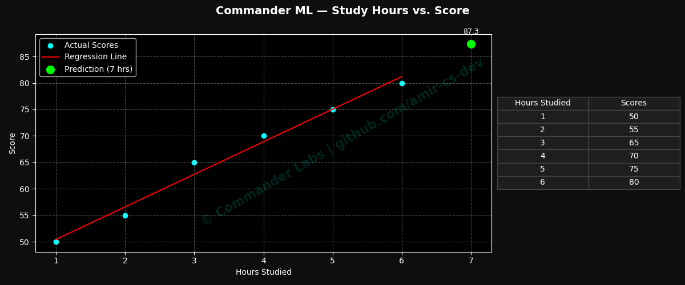

# 🧠 ML-Intro — Linear Regression & Dark-Mode Visualization

**Author:** [Amir](https://github.com/amir-cs-dev)  
**Project:** Commander Labs — Machine Learning Sandbox  

---

### 🚀 Overview
A simple yet elegant introduction to **Machine Learning** using **Linear Regression**.  
This notebook predicts student scores based on study hours — visualized in a **Commander Dark Mode** style chart.

---

### 🧩 Features
- ⚙️ Built from scratch in Python (no notebook dependencies)  
- 🌙 Custom Commander Dark Theme for Matplotlib  
- 📈 Regression line + predicted point annotation  
- 📊 Embedded side-by-side data table  

---

### 🧠 Tech Stack
| Category | Tools |
|-----------|-------|
| Language | Python 3 |
| Libraries | pandas, scikit-learn, matplotlib |
| IDE | VS Code |

---

### 📦 Installation
```bash
git clone https://github.com/amir-cs-dev/ml-intro.git
cd ml-intro
pip install -r requirements.txt
python ml_intro.py
---
---

## 📊 Results

Below is the generated output from **ml_intro.py**, showing the linear regression model predicting student scores based on study hours — visualized in the **Commander Labs Dark Mode** theme.

<p align="center">
  
</p>

**Prediction Example:**  
When a student studies **7 hours**, the model predicts a score of approximately **87.3**.

---
